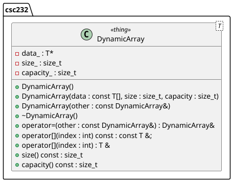

# LAB01 - Dynamic Arrays

This lab explores techniques for creating "dynamic" arrays that can be resized at runtime. This is done by declaring pointers to blocks of memory. These pointers behave exactly like arrays and can be used as such.

## Background

Before proceeding with this lab, the student should take the time to read

* Section C2.7 in [C++ Interlude 2 Memory Allocation, Pointers, and Polymorphism](https://msu.vitalsource.com/reader/books/9780138122782/epubcfi/6/104%5B%3Bvnd.vst.idref%3DP70010183410000000000000000013F2%5D!/4/2%5BP70010183410000000000000000013F2%5D/2/2%5BP70010183410000000000000000013F3%5D/3:15%5Bcat%2Cion%5D)
* Section 1.5.6 The Big-Five in the "Weiss" textbook

Recall the "Weiss" textbook is located in our Textbook course module, "Data Structures and Algorithm Analysis with C++", 4th Edition, by Mark Allen Weiss.

### Modeling a dynamic array

In this lab, we shall create a simple "wrapper" class that provides us with an object-oriented, dynamic array. Figure 1 displays the UML diagram for this simple model.




###### Figure 1: The `DynamicArray` class

Specifically, you'll focus on properly implementing constructors and destructors, including the copy constructor, as well as a new operator override, namely the `operator+` so that we can create new `DynamicArray` objects by "adding" two of them together using the `+` operator. For example:

```c++
// assuming a and b are existing DynamicArray<int> objects
csc232::DynamicArray<int> sum = a + b;
```

The result of this operation is a new `DynamicArray` that contains all the elements from `a` and all the elements from `b`. 

**Note**: The `csc232` namespace also defines a `constexpr` named `DEFAULT_CAPACITY`. This value corresponds to the default (initial) capacity for a `DynamicArray` object. Code defined within the `csc232` namespace can reference this constant by the `DEFAULT_CAPACITY` identifier.

## Objective

Upon successful completion of this lab, the student has learned how to

* model a dynamic array that properly
   * allocates and deallocates memory upon construction/destruction
   * allows construction from existing dynamic arrays
   * allows construction by "adding" two dynamic arrays together

## Getting Started

After accepting this assignment with the provided GitHub Classroom Assignment link, decide how you want to work with
your newly created repository:

* Using Codespaces directly in your web browser that employees the Visual Studio Code online IDE, or
* Using the IDE of your choice on your local machine

### Codespaces

If a Codespace is available for use (and this is your preferred method of development), open your newly created
repository in a Codespace.

At this point, you can skip to [Creating a development branch](#creating-a-development-branch).

### Local Development

Depending upon the IDE of your choice, many of the following steps may be taken within your IDE. It is up to you to
discover these tools (assuming they're available) and learn how to use them appropriately as desired. The following
instructions are assumed to take place within a terminal window. Note: many IDEs provide a terminal window as well.

#### Cloning your repository

The command you use to clone is slightly different depending upon whether
you're using `git` via `https`, `ssh`, or using the GitHub Cli via `gh`.

If you're using the `https` protocol, your clone command is:

```shell
git clone https://github.com/msu-csc232-sp25/<repo-name>.git
```

If you're using the `ssh` protocol, your clone command is:

```shell
git clone git@github.com:msu-csc232-sp25/<repo-name>.git
```

Finally, if you're using the GitHub CLI (`gh`), your clone command is:

```shell
gh repo clone msu-csc232-sp25/<repo-name>
```

After cloning the repository, navigate into the newly cloned repository:

```shell
cd <repo-name>
```

#### Creating a development branch

Next, create a branch named `develop`. Please note: The name of this branch **must** be as specified and will be, to the
grading scripts, case-sensitive.

```shell
git checkout -b develop
```

Make sure you are on the `develop` branch before you get started. Make all your commits on the `develop` branch.

```bash
git status
```

_You may have to type the `q` character to get back to the command line prompt after viewing the status._

## Tasks

This assignment consists of the following tasks:

* Task 1: Creating and destroying a instances of the `DynamicArray` class
* Task 2: Implement the copy assignment operator for a `DynamicArray`
* Task 3: Implement `operator+` for `DynamicArray`
  
**Note**: In Tasks 1 and 2, each `TODO` comment is located in the [src/](src/main/cpp/DynamicArray.cpp) source file. In Task 3, the `TODO` comment is located in [include/DynamicArray.h](include/DynamicArray.h).

### Additional System Requirements for local testing

Since a major concept in this lab is memory management, the unit tests that verify the correctness of your solutions utilize a program named `valgrind`. Unfortunately, this program is not installed, by default, on our Codespaces. Also, this program is only available for Linux operating systems. Fortunately, our Codespaces are Ubuntu distributions of Linux, meaning, we _can_ install `valgrind`. Enter the following commands in the terminal (console) window:

```bash
sudo apt update && sudo apt install valgrind
```

If you are uncomfortable doing this, you can still see the results of the unit tests when the GitHub workflow executes on your pushes.

### Task 1: Creating and destroying instances of the `DynamicArray` class

❌ Before you make any changes, be sure you're working a new branch named `develop`!

1. Locate the `TEST_TASK1` macro definition in the [include/csc232.h](include/csc232.h) header file and toggle it from `FALSE` to `TRUE`.
2. Locate the `TODO: Task 1a` comment and initialize the data members of the `DynamicArray` class accordingly.
3. Locate the `TODO: Task 1b` comment and free any dynamically allocated resources accordingly.
4. Locate the `TODO: Task 1c` comment and implement the copy constructor accordingly. Recall, your goal here is to make a _deep_ copy of the source object's attributes.
5. Verify your results by executing the `task1_test` target.
6. Once your happy with the results of the unit tests, stage, commit, and push your changes to GitHub.

### Task 2: Implement the copy assignment operator for the `DynamicArray` class

Task 2 is similar in nature to Task 1c, with the additional concern that destination object must ensure it has the capacity to make a _deep_ copy of the source object's attributes.

1. Locate the `TEST_TASK2` macro definition in the [include/csc232.h](include/csc232.h) header file and toggle it from `FALSE` to `TRUE`.
2. Locate the `TODO: Task 2` comment and implement the copy assignment operator of the `DynamicArray` class accordingly.
3. Verify your results by executing the `task2_test` target.
4. Once your happy with the results of the unit tests, stage, commit, and push your changes to GitHub.

### Task 3: Implement `operator+` for the `DynamicArray` class

Task 3 has similar concerns regarding target storage capacity. Here, you are essentially copying data from two source dynamic arrays objects.

There is an interesting design for the implementation of the `operator+` operator. We use a _non-member_ function to realize the proper functionality. This function is **not** a member of the `DynamicArray` class. It merely takes as parameters, two constant references to them. That is to say, 

```c++
// Assuming csc131_students aned csc232_students are two 
// DynamicArray<std::string> objects populated with data
csc232::DynamicArray<std::string> names;
names = csc131_students + csc232_students;
```
is equivalent to

```c++
csc232::DynamicArray<std::string> names;
 names = csc232::operator+(csc131_students, csc232_students);
```

Thus, we see how overloading the `operator+` provides us with a much cleaner syntax for handling such scenarios that apply.

1. Locate the `TEST_TASK3` macro definition in the [include/csc232.h](include/csc232.h) header file and toggle it from `FALSE` to `TRUE`.
2. Locate the `TODO: Task 3` comment and implement the "+" operator of the `DynamicArray` class accordingly.
3. Verify your results by executing the `task3_test` target.
4. Once your happy with the results of the unit tests, stage, commit, and push your changes to GitHub.

## Submission Details

Before submitting your assignment, be sure you have pushed all your changes to GitHub. If this is the first time you're
pushing your changes, the push command will look like:

```bash
git push -u origin develop
```

If you've already set up remote tracking (using the `-u origin develop` switch), then all you need to do is type

```bash
git push
```

As usual, prior to submitting your assignment on Brightspace, be sure that you have committed and pushed your final
changes to GitHub. Once your final changes have been pushed, create a pull request that seeks to merge the changes in
your `develop` branch into your `trunk` branch.

You can use `gh` to create this pull request right from your command-line prompt:

```bash
gh pr create --assignee "@me" --title "Some appropriate title" --body "A message to populate description, e.g., Go Bills!" --head develop --base trunk --reviewer msu-csc232-sp25/graders
```

An "appropriate" title is at a minimum, the name of the assignment, e.g., `LAB02` or `HW04`, etc.

Once your pull request has been created, submit the URL of your assignment _repository_ (i.e., _not_ the URL of the pull
request) as a Text Submission on Brightspace. Please note: the timestamp of the submission on Brightspace is used to
assess any late penalties if and when warranted, _not_ the date/time you create your pull request. **No exceptions will
be granted for this oversight**.

### Due Date

Your assignment submission is due by the end of the lab period.

### Grading Rubric

This assignment is worth **3 points**.

| Criteria           | Exceeds Expectations         | Meets Expectations                  | Below Expectations                  | Failure                                        |
|--------------------|------------------------------|-------------------------------------|-------------------------------------|------------------------------------------------|
| Pull Request (20%) | Submitted early, correct url | Submitted on-time; correct url      | Incorrect URL                       | No pull request was created or submitted       |
| Code Style (20%)   | Exemplary code style         | Consistent, modern coding style     | Inconsistent coding style           | No style whatsoever or no code changes present |
| Correctness^ (60%) | All unit tests pass          | At least 80% of the unit tests pass | At least 60% of the unit tests pass | Less than 50% of the unit tests pass           |

^ _The Google Test unit runner will calculate the correctness points based purely on the fraction of tests passed_.

### Late Penalty

* In the first 24-hour period following the due date, this assignment will be penalized 20%.
* In the second 24-hour period following the due date, this assignment will be penalized 40%.
* After 48 hours, the assignment will not be graded and thus earns no points.

## Disclaimer & Fair Use Statement

This repository may contain copyrighted material, the use of which may not
have been specifically authorized by the copyright owner. This material is
available in an effort to explain issues relevant to the course or to
illustrate the use and benefits of an educational tool. The material
contained in this repository is distributed without profit for research and
educational purposes. Only small portions of the original work are being
used and those could not be used to easily duplicate the original work.
